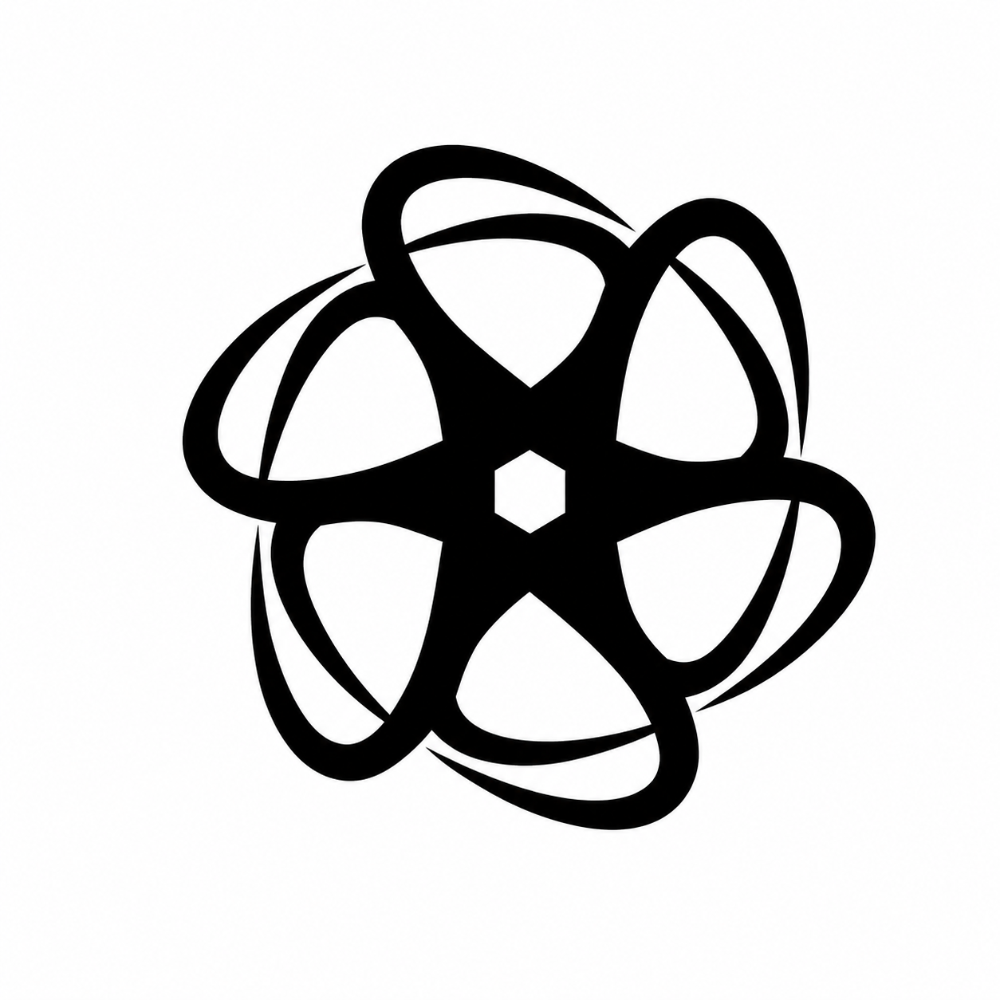

<p align="center">
  
</p>

<h1 align="center">ROBOTarm_NEXUS</h1>

<p align="center">一个面向 Isaac Lab / Isaac Sim 5.1 的最小机械臂抓取工程。</p>

当前仓库的目标非常明确：

- 保留一个可直接运行的最小场景
- 默认打开 `front` + `wrist` 两路相机
- 使用原工程对齐过的 Lula position-only IK 做抓取 / 抬升 / 放置
- 让项目结构足够清晰，后续可以继续替换机械臂模型、相机、夹爪、场景和任务逻辑

它不是训练仓库，不承担数据采集、LeRobot 数据集导出、策略训练、OpenPI/SmolVLA 集成等职责。

## 授权

本项目采用专有授权，默认不授予任何使用、运行、部署、复制、修改、传播或商业化许可。
完整声明见 [LICENSE.md](LICENSE.md)。

第三方依赖声明见 [project_identity/legal/NOTICE.md](project_identity/legal/NOTICE.md)。
贡献指南见 [project_identity/legal/CONTRIBUTING.md](project_identity/legal/CONTRIBUTING.md)。
行为准则见 [project_identity/legal/CODE_OF_CONDUCT.md](project_identity/legal/CODE_OF_CONDUCT.md)。

## NEXUS 品牌标识

本项目使用 NEXUS 统一品牌标识。品牌与法律资产位于 [`project_identity/`](project_identity/)：

- `project_identity/logo/nexus_logo.png` — 静态 logo（本 README 顶部已展示）
- `project_identity/logo/nexus_logo.py` — 动画 ASCII logo 脚本
- `project_identity/logo/play_logo_intro.sh` — 终端启动动画播放器

在终端播放启动动画（缺失依赖时会静默跳过，可在 `set -euo pipefail` 脚本中安全调用）：

```bash
bash project_identity/logo/play_logo_intro.sh 30 golden
```

可选样式：`golden`（默认）、`blackgold`、`cyber`、`ice`、`matrix`、`ember`、`random`。

## 当前能力

- 单机械臂桌面抓取场景
- 三个颜色方块
- 一个黑框白底目标区
- 两个相机：
  `front` 顶视前向相机
  `wrist` 腕部相机
- Lula IK 抬升测试
- Lula IK 抓取并放置到目标区
- GUI 模式默认自动打开两路相机 viewport

## 项目定位

这个仓库的设计原则是“最小但不糊”：

- 场景最小：只保留桌子、方块、目标区、光照、双相机、机械臂
- 控制链最小：只保留 Lula IK 抓取相关入口
- 结构清晰：把机器人 profile、场景、控制器、脚本共用逻辑分层
- 修改入口集中：尽量避免同一类配置散在多个文件里重复维护

## 标准化后的单一真源

如果你后面要继续改项目，优先从这几个文件入手：

| 文件 | 作用 | 什么时候改 |
|---|---|---|
| `ROBOTarm_NEXUS/core/specs.py` | 项目级常量与机器人 profile 入口 | 改环境 ID、机械臂命名、frame 名称、USD 文件名、Lula 资产文件名、默认抓取点、默认放置点 |
| `ROBOTarm_NEXUS/core/robot_cfg.py` | 机械臂 `ArticulationCfg`、关节限位、默认位姿、执行器参数 | 换机械臂 USD、改关节限位、改 PD、改默认姿态 |
| `ROBOTarm_NEXUS/core/scene_cfg.py` | 场景几何、相机、光照、目标区、EE frame transformer | 改桌面、改相机、改目标区、改抓取 frame 偏移 |
| `ROBOTarm_NEXUS/controllers/lula_ik.py` | Lula IK 控制器与手动 DLS 后端 | 换成不同结构的机械臂、不同关节语义、不同末端执行器时要重点看这里 |
| `ROBOTarm_NEXUS/scripts/grasping_common.py` | 抓取脚本共享逻辑 | 改校准文件、grasp-point 变换、wrist-roll 选择、脚本步进保护 |
| `ROBOTarm_NEXUS/scripts/run_env.py` | 纯环境冒烟脚本 | 改基础 smoke test 行为 |
| `ROBOTarm_NEXUS/scripts/run_ik.py` | 依次抓三块并抬起 | 改抬升验证逻辑 |
| `ROBOTarm_NEXUS/scripts/demo_pick_place.py` | 抓取并放到目标区 | 改抓放演示逻辑 |

一句话总结：

- 先改 `core/specs.py`
- 再改 `core/robot_cfg.py`
- 场景相关改 `core/scene_cfg.py`
- 真正“换机械臂控制逻辑”再动 `controllers/lula_ik.py`

## 目录结构

```text
ROBOTarm_NEXUS/
├── LICENSE.md
├── README.md
├── pyproject.toml
├── docs/
│   └── HANDOVER.md
├── project_identity/
│   ├── README.md
│   ├── logo/
│   │   ├── nexus_logo.py
│   │   ├── nexus_logo.png
│   │   └── play_logo_intro.sh
│   └── legal/
│       ├── LICENSE
│       ├── NOTICE.md
│       ├── CODE_OF_CONDUCT.md
│       └── CONTRIBUTING.md
├── scripts/
│   ├── run_env.sh
│   ├── run_ik.sh
│   └── run_pick_place.sh
├── tools/
│   └── isaaclab.sh
└── ROBOTarm_NEXUS/
    ├── __init__.py
    ├── assets/
    │   ├── ik/
    │   │   └── lula/
    │   └── robots/
    ├── controllers/
    │   ├── __init__.py
    │   └── lula_ik.py
    ├── core/
    │   ├── env.py
    │   ├── env_cfg.py
    │   ├── mdp.py
    │   ├── robot_cfg.py
    │   ├── scene_cfg.py
    │   └── specs.py
    └── scripts/
        ├── common.py
        ├── grasping_common.py
        ├── run_env.py
        ├── run_ik.py
        └── demo_pick_place.py
```

## 运行依赖

至少需要下面这些：

- Isaac Sim 5.1
- Isaac Lab
- 可用的 NVIDIA GPU
- 能被当前仓库读取到的机械臂 USD

当前默认 launcher 行为：

- `tools/isaaclab.sh` 会先 `source ../so101-clean/scripts/env.sh`
- 再把当前仓库根目录加到 `PYTHONPATH`
- 然后转交给 `/home/charles/ISAAC_SIM/IsaacLab/isaaclab.sh`

如果你的环境布局不同，可以覆盖：

- `SO101_ENV_SH`
- `ISAACLAB_SH`
- `SO101_USD_PATH`

## 机械臂 USD 解析顺序

当前 `core/robot_cfg.py` 的 USD 查找顺序是：

1. 环境变量 `SO101_USD_PATH`
2. `ROBOTarm_NEXUS/assets/robots/so101_follower.usd`
3. `ROBOTarm_NEXUS/assets/so101_follower.usd`
4. 从当前仓库的上层目录自动搜索常见 sibling/workspace 路径

最稳妥的做法是显式设置：

```bash
export SO101_USD_PATH=/abs/path/to/so101_follower.usd
```

## 快速开始

### 1. 进入仓库

```bash
cd /home/charles/ISAAC_SIM/sim/ROBOTarm_NEXUS
```

### 2. 设置 USD

```bash
export SO101_USD_PATH=/path/to/so101_follower.usd
```

### 3. 纯环境冒烟

```bash
./scripts/run_env.sh
```

### 4. Lula IK 抬升测试

```bash
./scripts/run_ik.sh
```

### 5. Lula IK 抓放演示

```bash
./scripts/run_pick_place.sh
```

## 常用环境变量

### 所有入口通用

| 变量 | 默认值 | 说明 |
|---|---|---|
| `DEVICE` | `cuda:0` | Isaac Sim / PhysX 设备 |
| `HEADLESS` | `0` | `1` 表示不打开 GUI |

### `run_env.sh`

| 变量 | 默认值 | 说明 |
|---|---|---|
| `NUM_ENVS` | `1` | 并行环境数 |
| `STEPS` | `200` | 冒烟步数 |
| `ZERO_ACTION` | `0` | 是否发送全零绝对关节目标 |

### `run_ik.sh`

| 变量 | 默认值 | 说明 |
|---|---|---|
| `STEPS` | `150` | 额外控制预算 |
| `DEBUG_IK` | `0` | `1` 时打印 IK 残差 |

### `run_pick_place.sh`

| 变量 | 默认值 | 说明 |
|---|---|---|
| `STEPS` | `90` | 额外控制预算 |
| `CUBE` | `cube_red` | 抓取目标 |
| `PLACE_X` | `0.26` | 放置点 X |
| `PLACE_Y` | `-0.34` | 放置点 Y |
| `PLACE_Z` | `0.4415` | 放置点 Z |

### 其他调试变量

| 变量 | 默认值 | 说明 |
|---|---|---|
| `SO101_DEBUG_IK` | `0` | Python 侧 IK 详细日志 |
| `SO101_FULL_SIM_SHUTDOWN` | `0` | 改回正常 `simulation_app.close()`，用于排查 Kit 退出问题 |

## 三个运行入口分别做什么

### `./scripts/run_env.sh`

用途：

- 仅验证环境是否能创建
- 验证机器人、方块、相机、观察空间是否正常
- 不跑 IK 抓取

适合：

- 改场景后先看能不能起
- 改相机后先看有没有出图
- 改机器人 USD 后先看 articulation 能不能正常加载

### `./scripts/run_ik.sh`

用途：

- 依次抓取红、绿、蓝三个方块
- 只验证抬升，不做最终放置
- 用来验证 “Lula IK + 双相机 + 接触抓取” 是否还通

适合：

- 刚改完机械臂模型
- 刚改完夹爪尺寸
- 刚换完 Lula URDF / descriptor

### `./scripts/run_pick_place.sh`

用途：

- 完整抓取一个方块
- 抬起
- 移动到目标区
- 放下
- 退回

适合：

- 最终演示
- 验证目标区位置和放置误差
- 看两个相机在完整抓放过程中的画面

## 代码架构

### 1. Gym 注册层

`ROBOTarm_NEXUS/__init__.py`

负责：

- `gym.register(...)`
- 绑定环境 ID 到 `core.env:SO101MinimalEnv`

现在环境 ID 不再在多个脚本里硬编码，统一从 `core/specs.py` 的 `ENV_ID` 引用。

### 2. 机器人 profile 层

`ROBOTarm_NEXUS/core/specs.py`

这里是这次标准化的关键文件。它集中收口了：

- `ENV_ID`
- `CUBE_NAMES`
- 默认 grasp-point
- 默认放置点
- 校准文件路径
- 机器人 prim 名称
- base / gripper / jaw frame 名称
- jaw offset
- 关节名列表
- arm joint / planar joint / gripper joint
- Lula 资产文件名
- USD 文件名与搜索规则

如果你以后要换另一个“相似结构”的机械臂，先改这里。

### 3. 机器人物理与执行器层

`ROBOTarm_NEXUS/core/robot_cfg.py`

负责：

- 加载 USD
- 定义 `ArticulationCfg`
- 定义默认 joint pose
- 设置执行器 stiffness / damping
- 设置重力开关
- 定义关节限位、rest pose、motor limit

这个文件是“机械臂物理行为”的单一真源。

### 4. 场景层

`ROBOTarm_NEXUS/core/scene_cfg.py`

负责：

- 桌面和地面几何
- 三个方块
- 黑框目标区
- 光照
- `front` / `wrist` 两路相机
- `ee_frame` transformer

你如果想改：

- 桌面尺寸
- 目标区位置
- 相机位置
- jaw offset

都应该优先改这里。

### 5. 环境层

`ROBOTarm_NEXUS/core/env.py`
`ROBOTarm_NEXUS/core/env_cfg.py`
`ROBOTarm_NEXUS/core/mdp.py`

职责拆分：

- `env.py`：
  `DirectRLEnv` 实现，负责 step/reset/reward/done
- `env_cfg.py`：
  场景实例化、viewer、physics、相机 observation space
- `mdp.py`：
  观测、方块随机排列、成功判定

当前成功条件是：

- 任意方块相对桌面抬起超过阈值

脚本化 Lula demo 会把这个阈值临时抬高，避免中途触发 IsaacLab auto-reset。

### 6. 控制器层

`ROBOTarm_NEXUS/controllers/lula_ik.py`

当前控制器同时包含两部分：

- 手动 DLS 后端
- 官方 Lula position-only IK 后端

真实抓取脚本主要走的是后者。

这个文件里仍然保留了比较强的 SO101 结构假设：

- 有 `shoulder_pan`
- 有 `wrist_roll`
- 末端是平行夹爪
- Lula 解的是 position-only
- 末端 frame 用的是 `gripper`

如果你换的是完全不同拓扑的机械臂，这个文件通常要一起改。

### 7. 脚本共享抓取逻辑

`ROBOTarm_NEXUS/scripts/grasping_common.py`

这里是这次新收口出来的复用层，避免 `run_ik.py` 和 `demo_pick_place.py` 继续复制同一套逻辑。

现在这里统一管理：

- 校准文件读取
- gripper -> grasp-point 坐标变换
- cube yaw 读取
- parallel-jaw wrist-roll 选择
- 脚本 step 时的 auto-reset 保护
- 平滑插值函数

如果后面改夹爪、改 grasp-point、改校准格式，先看这里。

### 8. 脚本公共运行层

`ROBOTarm_NEXUS/scripts/common.py`

负责：

- 相机 CUDA 检查
- 关闭相机
- 打开 GUI camera viewport
- 动态调 gripper effort limit
- 安全退出 Isaac Sim

这里一个重要标准化修复是：

- gripper joint 不再写死为 joint index `5`
- 现在通过 `core/specs.py` 里的 profile 动态解析 gripper joint name

这对后面换机械臂时很重要。

## 双相机说明

当前两路相机：

- `front`
  挂在 `Robot/base/front_camera`
- `wrist`
  挂在 `Robot/gripper/wrist_camera`

GUI 模式下：

- 主 viewport 保留
- 额外自动弹出两个 camera viewport

headless 模式下：

- 不显示 GUI
- 但仍会正常创建相机传感器并在 observation 中出图

注意：

- tiled camera 需要 CUDA
- `--enable_cameras` 配 `--device cpu` 会被直接拒绝

## 目标区说明

当前目标区包含两个对象：

- `TargetZoneBorder`
  黑框
- `TargetZone`
  白底

场景里的白底是平面视觉标记；
抓放脚本的默认放置点则是方块中心点世界坐标 `DEFAULT_PLACE_TARGET_W`。

如果你改目标区位置，通常要同时检查：

- `core/scene_cfg.py` 的 `TARGET_ZONE_POS`
- `core/specs.py` 的 `DEFAULT_PLACE_TARGET_W`

## 如何修改项目

### 修改桌子 / 背景 / 方块

主要改：

- `core/scene_cfg.py`

典型项：

- `TABLE_CENTER`
- `TABLE_SIZE`
- `CUBE_DEFAULT_POSITIONS`
- `CUBE_COLORS`
- `TARGET_ZONE_*`

### 修改相机

主要改：

- `core/scene_cfg.py`
- 必要时改 `scripts/common.py`

关注项：

- `front` / `wrist` 的 `prim_path`
- `offset.pos`
- `offset.rot`
- `focal_length`
- `horizontal_aperture`
- `width` / `height`
- `update_period`

### 修改默认抓取点

主要改：

- `core/specs.py` 的 `DEFAULT_GRASP_POINT_IN_GRIPPER`
- 或运行时提供 `~/.config/so101_control/ee_calibration.json`

### 修改目标放置点

主要改：

- `core/specs.py` 的 `DEFAULT_PLACE_TARGET_W`
- 或运行 `run_pick_place.sh` 时传 `PLACE_X/Y/Z`

### 修改环境 ID

主要改：

- `core/specs.py` 里的 `ENV_ID`

改完之后：

- `__init__.py`
- `run_env.py`
- `run_ik.py`
- `demo_pick_place.py`

都会自动跟着新 ID 走，因为现在都从 `specs.py` 取值。

## 换机械臂模型的完整清单

下面是最重要的部分。

如果你后面要换另一个机械臂模型，不要直接先改 demo 脚本。推荐顺序如下。

### 第 1 步：先改 `core/specs.py`

至少先明确这些字段：

- `model_name`
- `usd_env_var`
- `bundled_usd_filename`
- `usd_search_patterns`
- `prim_name`
- `base_frame_name`
- `ee_frame_name`
- `jaw_frame_name`
- `jaw_frame_offset`
- `joint_names`
- `arm_joint_names`
- `planar_joint_names`
- `gripper_joint_name`
- `lula_urdf_filename`
- `lula_descriptor_filename`

这一步的目标不是“直接跑通”，而是先把命名真源收口。

### 第 2 步：替换 USD

你需要保证新的机器人 USD 能被 `core/robot_cfg.py` 找到。

推荐做法：

```bash
export SO101_USD_PATH=/abs/path/to/your_robot.usd
```

如果你后面想彻底去掉 `SO101_` 这个环境变量名，也可以直接把 `specs.py` 里的 `usd_env_var` 改掉。

### 第 3 步：修改 `core/robot_cfg.py`

这里必须同步新的：

- 默认 joint pose
- 关节限位
- rest pose 范围
- 执行器 stiffness / damping
- effort / velocity limit
- 是否禁用重力

如果这些不改，常见结果是：

- 机械臂起不来
- 抓到东西后持续震荡
- IK 看似对，实际 joint target 不合理

### 第 4 步：修改 `core/scene_cfg.py`

这里要检查新的机器人 frame 是否真的存在：

- `base`
- `gripper`
- `jaw`

如果 frame 名称不同，至少要同步：

- `ee_frame` 的 `prim_path`
- target frame 的 `prim_path`
- jaw offset
- wrist camera 挂载点
- front camera 挂载点

### 第 5 步：替换 Lula 资产

当前 Lula 资产在：

- `ROBOTarm_NEXUS/assets/ik/lula/`

至少要同步新的：

- URDF
- robot description YAML
- 必要时 RMPFlow 相关配置

并在 `core/specs.py` 里把文件名改掉。

### 第 6 步：检查 `controllers/lula_ik.py`

这是最容易被低估的一步。

当前控制器不是完全通用控制器，它仍然默认：

- 机器人有 `shoulder_pan`
- 机器人有 `wrist_roll`
- 夹爪是平行夹爪
- 末端目标 frame 是 `gripper`
- 位置 IK 足够，不解目标姿态

如果你的新机械臂不满足这些条件，`lula_ik.py` 需要重构。

典型例子：

- 没有 `wrist_roll`
- 不是 5DOF
- 末端不是 parallel jaw
- 需要 orientation-constrained IK
- 夹爪 frame 名称不是 `gripper`

### 第 7 步：检查 `scripts/grasping_common.py`

这里隐含的是“并行夹爪抓方块”的任务假设。

如果你换的是：

- 吸盘
- 两指但非平行夹爪
- 多指手
- 旋转对称性不同的末端

至少要重新审视：

- `select_wrist_roll_target()`
- `wrap_parallel_jaw_angle()`
- grasp-point 的标定方式

### 第 8 步：重新跑三层验证

不要一上来就跑完整抓放。

推荐顺序：

1. `./scripts/run_env.sh`
2. `./scripts/run_ik.sh`
3. `./scripts/run_pick_place.sh`

如果第 1 步都过不了，先别碰 IK。

## 当前还存在的“硬耦合”

这部分很重要。虽然我已经把项目标准化了一步，但它还没有完全抽象成“任意机械臂都能即插即用”。

目前仍然存在这些真实耦合：

- `controllers/lula_ik.py` 仍然是 SO101 风格的关节语义
- 抓取脚本仍然假设抓的是桌面方块
- 抓取脚本仍然假设末端是 parallel jaw
- 校准文件仍然沿用 `~/.config/so101_control/ee_calibration.json`
- 类名仍然保留 `SO101Minimal*` 历史命名

这不是 bug，是当前工程边界。

如果你要做到“任意机械臂模板化切换”，下一阶段应该继续做：

- 把 `SO101MinimalEnvCfg` / `SO101MinimalEnv` 历史命名去品牌化
- 把 `lula_ik.py` 里和关节语义绑定的部分抽成 profile adapter
- 把抓取策略和机器人模型进一步解耦

## 验证建议

每次改大项时，建议按下面顺序验证。

### 改场景后

```bash
./scripts/run_env.sh
```

看：

- 环境能否创建
- 两个相机是否出图
- cube 是否在正确位置

### 改机器人后

```bash
HEADLESS=1 DEVICE=cuda:0 ./scripts/run_ik.sh
```

看：

- 能否完成 `approach -> descend -> grasp -> lift`
- 是否中途 reset
- 是否抓住后抖动

### 改抓放链后

```bash
HEADLESS=1 DEVICE=cuda:0 ./scripts/run_pick_place.sh
```

看：

- 是否能抓起
- 是否能移到目标区
- 是否能正常释放

## 常见问题

### 1. UI 里抓到后一直抽搐

通常不是 IK 算错，而是环境 success 条件触发了 IsaacLab auto-reset。
当前脚本已经对这个问题做了保护；如果再次出现，优先检查：

- `lift_height_threshold`
- 是否有别的 done 条件重新启用了

### 2. 相机不出图

先检查：

- 是否在 `cuda:0`
- 是否 headless / GUI 参数传对了
- 是否真的创建了 `front` / `wrist` sensor

### 3. Lula IK 初始化失败

先检查：

- Lula 扩展是否可用
- `assets/ik/lula/` 下的文件是否匹配当前机械臂
- URDF / descriptor 中的 joint 名称是否和 USD 一致

### 4. 能动但是抓不住

优先看：

- `DEFAULT_GRASP_POINT_IN_GRIPPER`
- `ee_calibration.json`
- jaw offset
- gripper effort limit
- cube / gripper 接触参数

## 面向修改者的建议

如果你只是想改行为，不要先去改 demo。

推荐顺序是：

1. 先改 `core/specs.py`
2. 再改 `core/robot_cfg.py`
3. 再改 `core/scene_cfg.py`
4. 最后才改 `controllers/lula_ik.py` 和 `scripts/*.py`

这样可以避免“脚本改通了，但底层配置已经分叉”的维护灾难。

## 更详细的工程记录

如果你需要历史背景、迁移过程和更底层的排障记录，看：

- [docs/HANDOVER.md](docs/HANDOVER.md)

这个 README 主要负责告诉你：

- 这个项目现在是什么
- 入口在哪里
- 结构怎么分
- 换机械臂时具体改哪几个文件
